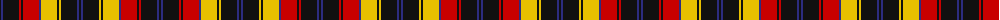

The parent of this is [Robieson QAHS (Fashion)](/tartans/k/2/db2/k16/r2/k2/r16/db2/y16/k2/y2/k16/db2/k/2/)

This was sourced from tartans-authority.  It is a [13 stripes tartan](/stripes/stripes13/).

Original link http://www.tartansauthority.com/tartan-ferret/display/7838/

## Thread count
K/2 DB2 K16 R2 K2 R16 DB2 Y16 K2 Y2 K16 DB2 K/2

## Palette
Each colour and its ΔE from the base-6 reference it is a variant of.

| Colour | Shade | Base | ΔE (OKLab) |
|---|---|---|---|
| DB |  `#2C2C80` | B  | 0.05 |
| K |  `#101010` | K  | 0.17 |
| R |  `#C80000` | R  | 0.00 |
| Y |  `#E8C000` | Y  | 0.00 |

ID: /variants/k/2/db2/k16/r2/k2/r16/db2/y16/k2/y2/k16/db2/k/2-db2c2c80-k101010-rc80000-ye8c000/
