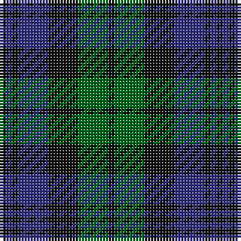

The parent of this is [Strathspey District Tartan Tartan Number: 1039. Earliest known date: 1795 From the back of a waistcoat of a Strathspey Fencible 1794-5. The design, which is a variation of the Black Watch may be attributed to General James Grant of Ballindalloch who raised the fencible unit and whose clan already used the the Black Watch as a hunting sett. The Strathspey tartan is now produced as a District tartan. See products available Copyright © Blair Urquhart, Comrie, 2015](/tartans/k/2/db2/k2/db10/k10/g10/k/2/)

This was sourced from house-of-tartan.  It is a [7 stripes tartan](/stripes/stripes7/).

Original link http://www.house-of-tartan.scotland.net/house/TartanViewjs.asp?colr=Def&tnam=1039

## Thread count
K/2 DB2 K2 DB10 K10 G10 K/2

## Palette
Each colour and its ΔE from the base-6 reference it is a variant of.

| Colour | Shade | Base | ΔE (OKLab) |
|---|---|---|---|
| DB |  `#2C2C80` | B  | 0.05 |
| G |  `#006818` | G  | 0.02 |
| K |  `#101010` | K  | 0.17 |

# Sample pattern

ID: /variants/k/2/db2/k2/db10/k10/g10/k/2-db2c2c80-g006818-k101010/
