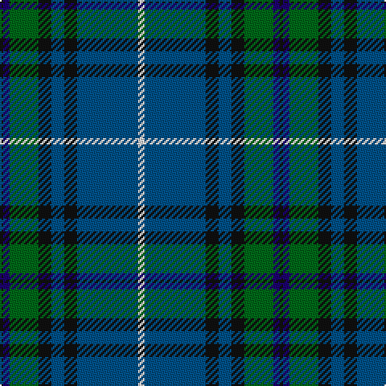

The parent of this is [Dollar Academy (1999) (Corporate)](/tartans/k/2/db4/g18/k8/dba8/k8/dba38/ln/4/)

This was sourced from tartans-authority.  It is a [8 stripes tartan](/stripes/stripes8/).

Original link http://www.tartansauthority.com/tartan-ferret/display/2668/

## Thread count
K/2 DB4 G18 K8 DBa8 K8 DBa38 LN/4

## Palette
Each colour and its ΔE from the base-6 reference it is a variant of.

| Colour | Shade | Base | ΔE (OKLab) |
|---|---|---|---|
| DB |  `#1C0070` | B  | 0.14 |
| DBa |  `#005088` | B  | 0.05 |
| G |  `#006818` | G  | 0.02 |
| K |  `#101010` | K  | 0.17 |
| LN |  `#E0E0E0` | W  | 0.06 |

# Sample pattern

ID: /variants/k/2/db4/g18/k8/dba8/k8/dba38/ln/4-db1c0070-dba005088-g006818-k101010-lne0e0e0/
