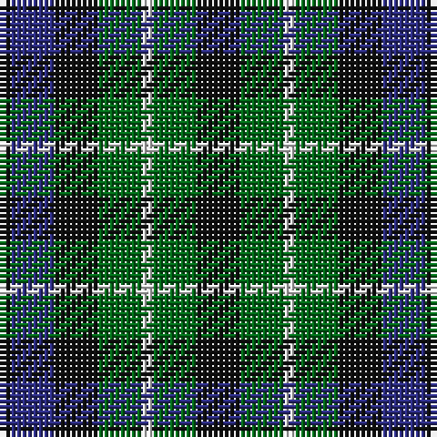

The parent of this is [Graham of Montrose Clan Tartan Tartan Number: 1044. Earliest known date: 1810-15 This sett was woven by Wilson's of Bannockburn around 1819. Wilson called it the No. 64 or 'Abercrombie' pattern, and produced it in various colours. In yellow it becomes the Breadalbane and in red, the MacCallum. The white striped Graham tartan is also known as MacLaggan. It is worn unofficially by 205 (sc) General Hospital RAMCV. There is a sample dating from 1815, labelled 'Graham', in the Cockburn Collection. It was first published in the Smith's book of 1850. See also Montrose, Menteith. See products available Copyright © Blair Urquhart, Comrie, 2015](/tartans/k/2/db8/k8/g8/ln2/g8/k/8/)

This was sourced from house-of-tartan.  It is a [7 stripes tartan](/stripes/stripes7/).

Original link http://www.house-of-tartan.scotland.net/house/TartanViewjs.asp?colr=Def&tnam=1044

## Thread count
K/2 DB8 K8 G8 LN2 G8 K/8

## Palette
Each colour and its ΔE from the base-6 reference it is a variant of.

| Colour | Shade | Base | ΔE (OKLab) |
|---|---|---|---|
| DB |  `#2C2C80` | B  | 0.05 |
| G |  `#006818` | G  | 0.02 |
| K |  `#101010` | K  | 0.17 |
| LN |  `#E0E0E0` | W  | 0.06 |

# Sample pattern

ID: /variants/k/2/db8/k8/g8/ln2/g8/k/8-db2c2c80-g006818-k101010-lne0e0e0/
