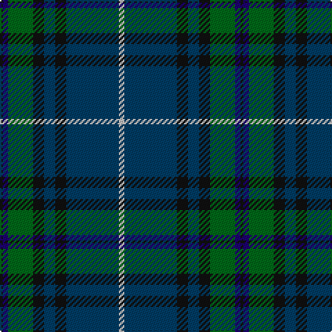

The parent of this is [Dollar Academy (1999)](/tartans/k/2/dba4/g18/k8/db8/k8/db38/n/4/)

This was sourced from register-of-tartans.  It is a [8 stripes tartan](/stripes/stripes8/).

Original link https://www.tartanregister.gov.uk/tartanDetails.aspx?ref=946

## Thread count
K/2 DBa4 G18 K8 DB8 K8 DB38 N/4

## Palette
Each colour and its ΔE from the base-6 reference it is a variant of.

| Colour | Shade | Base | ΔE (OKLab) |
|---|---|---|---|
| DB |  `#003C64` | B  | 0.07 |
| DBa |  `#1C0070` | B  | 0.14 |
| G |  `#006818` | G  | 0.02 |
| K |  `#101010` | K  | 0.17 |
| N |  `#C0C0C0` | W  | 0.16 |

# Sample pattern

ID: /variants/k/2/dba4/g18/k8/db8/k8/db38/n/4-db003c64-dba1c0070-g006818-k101010-nc0c0c0/
