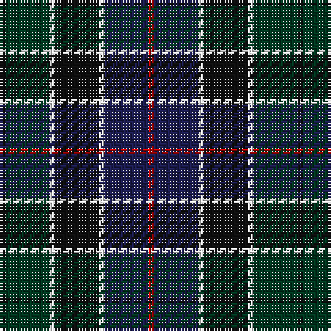

The parent of this is [Caie (2013)](/tartans/k/2/dg16/w2/k16/w2/db16/r/2/)

This was sourced from register-of-tartans.  It is a [7 stripes tartan](/stripes/stripes7/).

Original link https://www.tartanregister.gov.uk/tartanDetails.aspx?ref=10865

## Thread count
K/2 DG16 W2 K16 W2 DB16 R/2

## Palette
Each colour and its ΔE from the base-6 reference it is a variant of.

| Colour | Shade | Base | ΔE (OKLab) |
|---|---|---|---|
| DB |  `#1C1C50` | B  | 0.14 |
| DG |  `#003820` | G  | 0.16 |
| K |  `#101010` | K  | 0.17 |
| R |  `#C80000` | R  | 0.00 |
| W |  `#FFFFFF` | W  | 0.03 |

# Sample pattern

ID: /variants/k/2/dg16/w2/k16/w2/db16/r/2-db1c1c50-dg003820-k101010-rc80000-wffffff/
