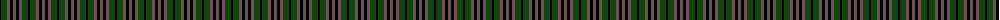
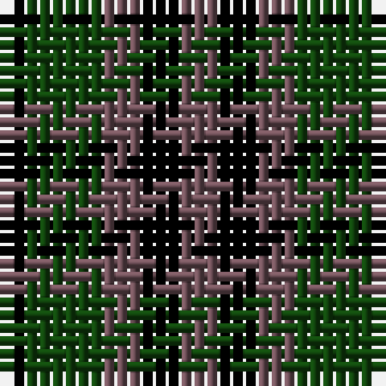

The parent of this is [Austin WI](/tartans/k/2/dg6/n3/k3/n/3/)

This was sourced from weddslist.  It is a [5 stripes tartan](/stripes/stripes5/).

Original link http://www.weddslist.com/cgi-bin/tartans/pg.pl?source=x

## Thread count
K/2 DG6 N3 K3 N/3

## Palette
Each colour and its ΔE from the base-6 reference it is a variant of.

| Colour | Shade | Base | ΔE (OKLab) |
|---|---|---|---|
| DG |  `#11450D` | G  | 0.10 |
| K |  `#000000` | K  | 0.00 |
| N |  `#6E5058` | B  | 0.14 |

# Sample pattern

ID: /variants/k/2/dg6/n3/k3/n/3-dg11450d-k000000-n6e5058/
