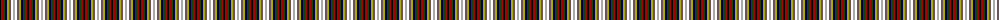

The parent of this is [Rainbow](/tartans/k/2/dr2/dg2/db2/lg2/n2/d2/na/2/)

This was sourced from weddslist.  It is a [8 stripes tartan](/stripes/stripes8/).

Original link http://www.weddslist.com/cgi-bin/tartans/pg.pl?source=x

## Thread count
K/2 DR2 DG2 DB2 LG2 N2 D2 Na/2

## Palette
Each colour and its ΔE from the base-6 reference it is a variant of.

| Colour | Shade | Base | ΔE (OKLab) |
|---|---|---|---|
| B |  `#00AAAA` | G  | 0.26 |
| DB |  `#000052` | B  | 0.20 |
| DG |  `#11450D` | G  | 0.10 |
| DR |  `#AA0000` | R  | 0.06 |
| K |  `#000000` | K  | 0.00 |
| LG |  `#AAAA00` | Y  | 0.11 |
| N |  `#6E5058` | B  | 0.14 |
| Na |  `#AAAAAA` | Y  | 0.19 |

# Sample pattern

ID: /variants/k/2/dr2/dg2/db2/lg2/n2/d2/na/2-b00aaaa-db000052-dg11450d-draa0000-k000000-lgaaaa00-n6e5058-naaaaaaa/
