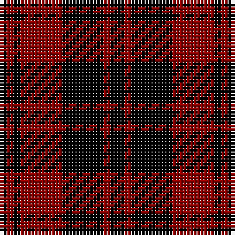

The parent of this is [Campbell of Lochlane (Artefact)](/tartans/k/2/dr2/k2/dr12/k12/dr2/k/4/)

This was sourced from tartans-authority.  It is a [7 stripes tartan](/stripes/stripes7/).

Original link http://www.tartansauthority.com/tartan-ferret/display/3799/

## Thread count
K/2 DR2 K2 DR12 K12 DR2 K/4

## Palette
Each colour and its ΔE from the base-6 reference it is a variant of.

| Colour | Shade | Base | ΔE (OKLab) |
|---|---|---|---|
| DR |  `#8C0000` | R  | 0.13 |
| K |  `#000000` | K  | 0.00 |

# Sample pattern

ID: /variants/k/2/dr2/k2/dr12/k12/dr2/k/4-dr8c0000-k000000/
