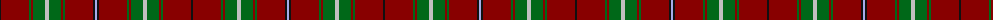

The parent of this is [MacMaster Clan/Family Tartan Tartan Number: 3493. Earliest known date: 1986 Designed by Phil Smith in 1986 for all of the names MacMaster, MacMasters etc. See MacMasters Canada. See products available Copyright © Blair Urquhart, Comrie, 2015](/tartans/k/2/dr28/g2/dr2/g12/n4/g12/dr2/g2/dr28/k2/lp/2/)

This was sourced from house-of-tartan.  It is a [12 stripes tartan](/stripes/stripes12/).

Original link http://www.house-of-tartan.scotland.net/house/TartanViewjs.asp?colr=Def&tnam=3493

## Thread count
K/2 DR28 G2 DR2 G12 N4 G12 DR2 G2 DR28 K2 LP/2

## Palette
Each colour and its ΔE from the base-6 reference it is a variant of.

| Colour | Shade | Base | ΔE (OKLab) |
|---|---|---|---|
| DR |  `#880000` | R  | 0.14 |
| G |  `#006818` | G  | 0.02 |
| K |  `#101010` | K  | 0.17 |
| LP |  `#A8ACE8` | W  | 0.22 |
| N |  `#C0C0C0` | W  | 0.16 |

ID: /variants/k/2/dr28/g2/dr2/g12/n4/g12/dr2/g2/dr28/k2/lp/2-dr880000-g006818-k101010-lpa8ace8-nc0c0c0/
