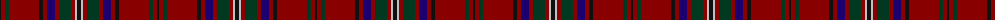

The parent of this is [MacClure (Name)](/tartans/k/2/dr4/dg4/dr30/k4/dr4/db8/dr4/dg12/dr4/n2/k/4/)

This was sourced from tartans-authority.  It is a [12 stripes tartan](/stripes/stripes12/).

Original link http://www.tartansauthority.com/tartan-ferret/display/3330/

## Thread count
K/2 DR4 DG4 DR30 K4 DR4 DB8 DR4 DG12 DR4 N2 K/4

## Palette
Each colour and its ΔE from the base-6 reference it is a variant of.

| Colour | Shade | Base | ΔE (OKLab) |
|---|---|---|---|
| DB |  `#1C0070` | B  | 0.14 |
| DG |  `#003820` | G  | 0.16 |
| DR |  `#880000` | R  | 0.14 |
| K |  `#101010` | K  | 0.17 |
| N |  `#C0C0C0` | W  | 0.16 |

ID: /variants/k/2/dr4/dg4/dr30/k4/dr4/db8/dr4/dg12/dr4/n2/k/4-db1c0070-dg003820-dr880000-k101010-nc0c0c0/
