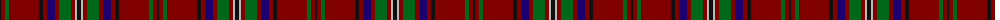

The parent of this is [MacClure Clan/Family Tartan Tartan Number: 3330. Earliest known date: pre 2002 Designed by Phil Smith for all MacClures. (note by Phil Smith Sept 2004) and originally woven by D C Dalgliesh. MacClures and MacLures are a sept of MacLeod. See products available Copyright © Blair Urquhart, Comrie, 2015](/tartans/k/2/dr4/g4/dr30/k4/dr4/db8/dr4/g12/dr4/n2/k/4/)

This was sourced from house-of-tartan.  It is a [12 stripes tartan](/stripes/stripes12/).

Original link http://www.house-of-tartan.scotland.net/house/TartanViewjs.asp?colr=Def&tnam=3330

## Thread count
K/2 DR4 G4 DR30 K4 DR4 DB8 DR4 G12 DR4 N2 K/4

## Palette
Each colour and its ΔE from the base-6 reference it is a variant of.

| Colour | Shade | Base | ΔE (OKLab) |
|---|---|---|---|
| DB |  `#1C0070` | B  | 0.14 |
| DR |  `#800000` | R  | 0.16 |
| G |  `#006818` | G  | 0.02 |
| K |  `#101010` | K  | 0.17 |
| N |  `#B8B8B8` | Y  | 0.17 |

ID: /variants/k/2/dr4/g4/dr30/k4/dr4/db8/dr4/g12/dr4/n2/k/4-db1c0070-dr800000-g006818-k101010-nb8b8b8/
