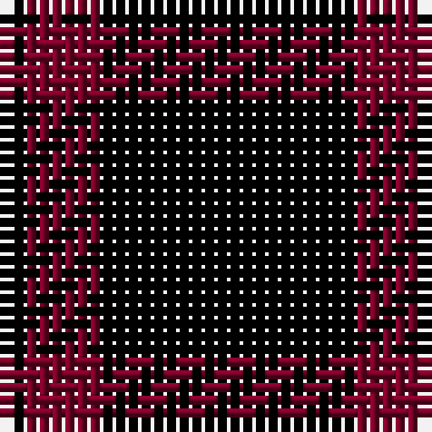

The parent of this is [Red Watch](/tartans/k/2/dr6/k/20/)

This was sourced from register-of-tartans.  It is a [3 stripes tartan](/stripes/stripes3/).

Original link https://www.tartanregister.gov.uk/tartanDetails.aspx?ref=3480

## Thread count
K/2 DR6 K/20

## Palette
Each colour and its ΔE from the base-6 reference it is a variant of.

| Colour | Shade | Base | ΔE (OKLab) |
|---|---|---|---|
| DR |  `#780028` | R  | 0.18 |
| K |  `#000000` | K  | 0.00 |

# Sample pattern

ID: /variants/k/2/dr6/k/20-dr780028-k000000/
