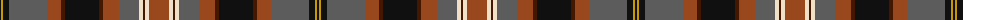

The parent of this is [Scottish Wildcat](/tartans/k/2/dy2/k6/n38/t14/dr4/k34/dr4/t16/n20/w4/dr2/w4/t/20/)

This was sourced from register-of-tartans.  It is a [14 stripes tartan](/stripes/stripes14/).

Original link https://www.tartanregister.gov.uk/tartanDetails.aspx?ref=11196

## Thread count
K/2 DY2 K6 N38 T14 DR4 K34 DR4 T16 N20 W4 DR2 W4 T/20

## Palette
Each colour and its ΔE from the base-6 reference it is a variant of.

| Colour | Shade | Base | ΔE (OKLab) |
|---|---|---|---|
| DR |  `#441800` | B  | 0.22 |
| DY |  `#C89800` | Y  | 0.12 |
| K |  `#101010` | K  | 0.17 |
| N |  `#5C5C5C` | B  | 0.14 |
| T |  `#98481C` | R  | 0.11 |
| W |  `#F0E0C8` | W  | 0.06 |

ID: /variants/k/2/dy2/k6/n38/t14/dr4/k34/dr4/t16/n20/w4/dr2/w4/t/20-dr441800-dyc89800-k101010-n5c5c5c-t98481c-wf0e0c8/
