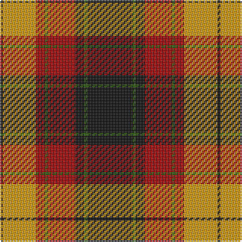

The parent of this is [Island of Innis, The (Fashion)](/tartans/k/2/dy22/dr6/g2/dr18/k6/g2/k/30/)

This was sourced from tartans-authority.  It is a [8 stripes tartan](/stripes/stripes8/).

Original link http://www.tartansauthority.com/tartan-ferret/display/5279/

## Thread count
K/2 DY22 DR6 G2 DR18 K6 G2 K/30

## Palette
Each colour and its ΔE from the base-6 reference it is a variant of.

| Colour | Shade | Base | ΔE (OKLab) |
|---|---|---|---|
| DR |  `#A00000` | R  | 0.09 |
| DY |  `#D09800` | Y  | 0.11 |
| G |  `#285800` | G  | 0.04 |
| K |  `#101010` | K  | 0.17 |

# Sample pattern

ID: /variants/k/2/dy22/dr6/g2/dr18/k6/g2/k/30-dra00000-dyd09800-g285800-k101010/
