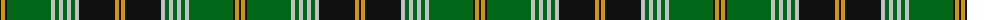

The parent of this is [Hammarby Football Club (Corp)](/tartans/k/2/dy4/k2/g44/n4/g4/n4/g4/n4/g4/n4/k36/dy4/k/2/)

This was sourced from tartans-authority.  It is a [14 stripes tartan](/stripes/stripes14/).

Original link http://www.tartansauthority.com/tartan-ferret/display/2661/

## Thread count
K/2 DY4 K2 G44 N4 G4 N4 G4 N4 G4 N4 K36 DY4 K/2

## Palette
Each colour and its ΔE from the base-6 reference it is a variant of.

| Colour | Shade | Base | ΔE (OKLab) |
|---|---|---|---|
| DY |  `#D09800` | Y  | 0.11 |
| G |  `#006818` | G  | 0.02 |
| K |  `#101010` | K  | 0.17 |
| N |  `#C0C0C0` | W  | 0.16 |

ID: /variants/k/2/dy4/k2/g44/n4/g4/n4/g4/n4/g4/n4/k36/dy4/k/2-dyd09800-g006818-k101010-nc0c0c0/
