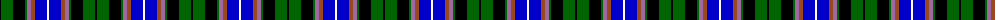
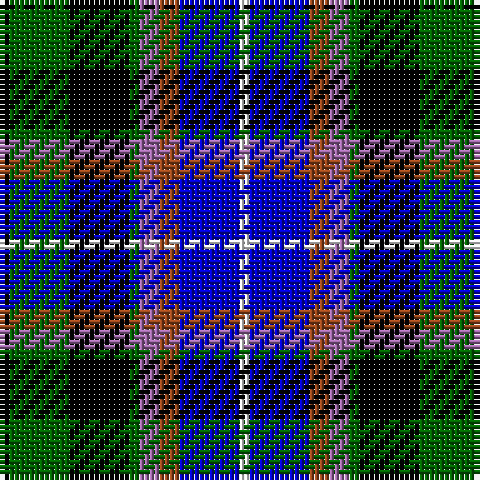

The parent of this is [Hebridean Celebration](/tartans/k/2/g12/k12/g2/lp4/t4/b12/w/2/)

This was sourced from register-of-tartans.  It is a [8 stripes tartan](/stripes/stripes8/).

Original link https://www.tartanregister.gov.uk/tartanDetails.aspx?ref=11620

## Thread count
K/2 G12 K12 G2 LP4 T4 B12 W/2

## Palette
Each colour and its ΔE from the base-6 reference it is a variant of.

| Colour | Shade | Base | ΔE (OKLab) |
|---|---|---|---|
| B |  `#0000C8` | B  | 0.15 |
| G |  `#006400` | G  | 0.00 |
| K |  `#000000` | K  | 0.00 |
| LP |  `#9C68A4` | R  | 0.21 |
| T |  `#98481C` | R  | 0.11 |
| W |  `#FCFCFC` | W  | 0.03 |

# Sample pattern

ID: /variants/k/2/g12/k12/g2/lp4/t4/b12/w/2-b0000c8-g006400-k000000-lp9c68a4-t98481c-wfcfcfc/
