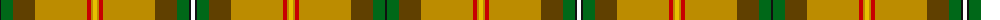

The parent of this is [Saskatchewan](/tartans/k/2/g12/ta22/dy52/r4/dy2/ya4/dy2/r4/dy52/ta22/g12/k2/w/4/)

This was sourced from register-of-tartans.  It is a [14 stripes tartan](/stripes/stripes14/).

Original link https://www.tartanregister.gov.uk/tartanDetails.aspx?ref=3656

## Thread count
K/2 G12 Ta22 DY52 R4 DY2 Ya4 DY2 R4 DY52 Ta22 G12 K2 W/4

## Palette
Each colour and its ΔE from the base-6 reference it is a variant of.

| Colour | Shade | Base | ΔE (OKLab) |
|---|---|---|---|
| DY |  `#BC8C00` | Y  | 0.16 |
| G |  `#006818` | G  | 0.02 |
| K |  `#101010` | K  | 0.17 |
| O |  `#D87C00` | Y  | 0.17 |
| R |  `#C80000` | R  | 0.00 |
| T |  `#4C3428` | B  | 0.16 |
| Ta |  `#604000` | G  | 0.14 |
| W |  `#FCFCFC` | W  | 0.03 |
| Y |  `#E8C000` | Y  | 0.00 |
| Ya |  `#E8C000` | Y  | 0.00 |

ID: /variants/k/2/g12/ta22/dy52/r4/dy2/ya4/dy2/r4/dy52/ta22/g12/k2/w/4-dybc8c00-g006818-k101010-od87c00-rc80000-t4c3428-ta604000-wfcfcfc-ye8c000-yae8c000/
