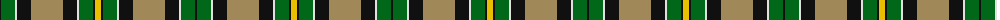

The parent of this is [Hamilton of Brandon](/tartans/k/2/g14/ln2/k14/lt32/k14/ln2/g14/k2/y/6/)

This was sourced from register-of-tartans.  It is a [10 stripes tartan](/stripes/stripes10/).

Original link https://www.tartanregister.gov.uk/tartanDetails.aspx?ref=1579

## Thread count
K/2 G14 LN2 K14 LT32 K14 LN2 G14 K2 Y/6

## Palette
Each colour and its ΔE from the base-6 reference it is a variant of.

| Colour | Shade | Base | ΔE (OKLab) |
|---|---|---|---|
| G |  `#006818` | G  | 0.02 |
| K |  `#101010` | K  | 0.17 |
| LN |  `#E0E0E0` | W  | 0.06 |
| LT |  `#A08858` | Y  | 0.21 |
| N |  `#C0C0C0` | W  | 0.16 |
| Y |  `#E8C000` | Y  | 0.00 |

ID: /variants/k/2/g14/ln2/k14/lt32/k14/ln2/g14/k2/y/6-g006818-k101010-lne0e0e0-lta08858-nc0c0c0-ye8c000/
