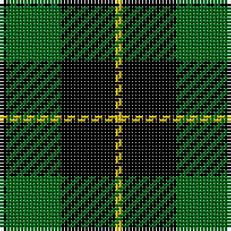

The parent of this is [Wallace Htg (Clan)](/tartans/k/2/g16/k16/y/2/)

This was sourced from tartans-authority.  It is a [4 stripes tartan](/stripes/stripes4/).

Original link http://www.tartansauthority.com/tartan-ferret/display/1101/

## Thread count
K/2 G16 K16 Y/2

## Palette
Each colour and its ΔE from the base-6 reference it is a variant of.

| Colour | Shade | Base | ΔE (OKLab) |
|---|---|---|---|
| G |  `#006818` | G  | 0.02 |
| K |  `#000000` | K  | 0.00 |
| Y |  `#DCBC00` | Y  | 0.02 |

# Sample pattern

ID: /variants/k/2/g16/k16/y/2-g006818-k000000-ydcbc00/
