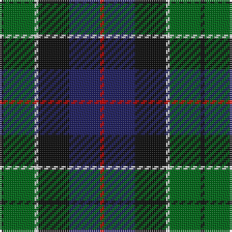

The parent of this is [Leslie Htg - 1850 (Clan)](/tartans/k/2/g16/ln2/k16/db16/r/2/)

This was sourced from tartans-authority.  It is a [6 stripes tartan](/stripes/stripes6/).

Original link http://www.tartansauthority.com/tartan-ferret/display/1113/

## Thread count
K/2 G16 LN2 K16 DB16 R/2

## Palette
Each colour and its ΔE from the base-6 reference it is a variant of.

| Colour | Shade | Base | ΔE (OKLab) |
|---|---|---|---|
| DB |  `#202060` | B  | 0.11 |
| G |  `#006818` | G  | 0.02 |
| K |  `#101010` | K  | 0.17 |
| LN |  `#E0E0E0` | W  | 0.06 |
| R |  `#C80000` | R  | 0.00 |

# Sample pattern

ID: /variants/k/2/g16/ln2/k16/db16/r/2-db202060-g006818-k101010-lne0e0e0-rc80000/
