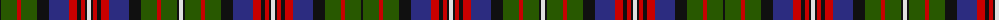

The parent of this is [Hargis](/tartans/k/2/g16/r4/g16/k12/db20/r8/k4/r4/k2/ln4/k2/r4/k4/r8/db20/k12/g16/r4/g16/k2/ln/4/)

This was sourced from register-of-tartans.  It is a [22 stripes tartan](/stripes/stripes22/).

Original link https://www.tartanregister.gov.uk/tartanDetails.aspx?ref=5099

## Thread count
K/2 G16 R4 G16 K12 DB20 R8 K4 R4 K2 LN4 K2 R4 K4 R8 DB20 K12 G16 R4 G16 K2 LN/4

## Palette
Each colour and its ΔE from the base-6 reference it is a variant of.

| Colour | Shade | Base | ΔE (OKLab) |
|---|---|---|---|
| DB |  `#2C2C80` | B  | 0.05 |
| G |  `#285800` | G  | 0.04 |
| K |  `#101010` | K  | 0.17 |
| LN |  `#E0E0E0` | W  | 0.06 |
| R |  `#C80000` | R  | 0.00 |

ID: /variants/k/2/g16/r4/g16/k12/db20/r8/k4/r4/k2/ln4/k2/r4/k4/r8/db20/k12/g16/r4/g16/k2/ln/4-db2c2c80-g285800-k101010-lne0e0e0-rc80000/
