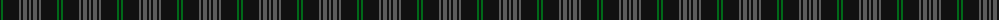
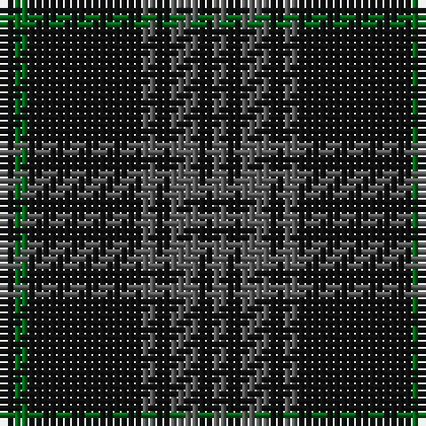

The parent of this is [Nightstalker (Corporate)](/tartans/k/2/g2/k16/n2/k2/n4/k2/n/2/)

This was sourced from tartans-authority.  It is a [8 stripes tartan](/stripes/stripes8/).

Original link http://www.tartansauthority.com/tartan-ferret/display/7796/

## Thread count
K/2 G2 K16 N2 K2 N4 K2 N/2

## Palette
Each colour and its ΔE from the base-6 reference it is a variant of.

| Colour | Shade | Base | ΔE (OKLab) |
|---|---|---|---|
| G |  `#006818` | G  | 0.02 |
| K |  `#101010` | K  | 0.17 |
| N |  `#5C5C5C` | B  | 0.14 |

# Sample pattern

ID: /variants/k/2/g2/k16/n2/k2/n4/k2/n/2-g006818-k101010-n5c5c5c/
