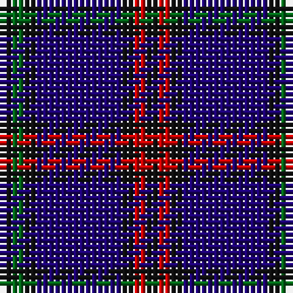

The parent of this is [Eglinton (District?)](/tartans/k/2/g2/k2/db14/k2/r2/k/2/)

This was sourced from tartans-authority.  It is a [7 stripes tartan](/stripes/stripes7/).

Original link http://www.tartansauthority.com/tartan-ferret/display/2075/

## Thread count
K/2 G2 K2 DB14 K2 R2 K/2

## Palette
Each colour and its ΔE from the base-6 reference it is a variant of.

| Colour | Shade | Base | ΔE (OKLab) |
|---|---|---|---|
| DB |  `#1C0070` | B  | 0.14 |
| G |  `#006818` | G  | 0.02 |
| K |  `#101010` | K  | 0.17 |
| R |  `#C80000` | R  | 0.00 |

# Sample pattern

ID: /variants/k/2/g2/k2/db14/k2/r2/k/2-db1c0070-g006818-k101010-rc80000/
