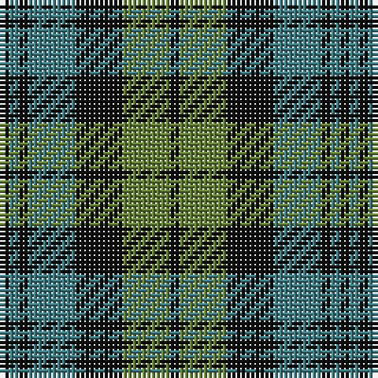

The parent of this is [Strathspey District (District)](/tartans/k/2/g2/k2/g10/k10/ga10/k/2/)

This was sourced from tartans-authority.  It is a [7 stripes tartan](/stripes/stripes7/).

Original link http://www.tartansauthority.com/tartan-ferret/display/1039/

## Thread count
K/2 G2 K2 G10 K10 Ga10 K/2

## Palette
Each colour and its ΔE from the base-6 reference it is a variant of.

| Colour | Shade | Base | ΔE (OKLab) |
|---|---|---|---|
| G |  `#407C84` | G  | 0.18 |
| Ga |  `#648038` | G  | 0.14 |
| K |  `#101010` | K  | 0.17 |

# Sample pattern

ID: /variants/k/2/g2/k2/g10/k10/ga10/k/2-g407c84-ga648038-k101010/
