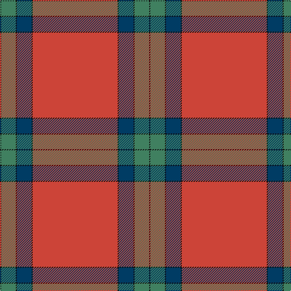

The parent of this is [Lawers Estate Corporate Tartan Tartan Number: 5398. Earliest known date: 1992 From a kilt worn by Mr Gibbons, owner of Lawers Estate near Comrie. Mr Gibbons said that the tartan had been specially woven by the London Kiltmakers based on a historic pattern associated with the estate. Details from Peter E MacDonald. The pattern is asymmetric and uses two thread black stripes to delineate the colours. See products available Copyright © Blair Urquhart, Comrie, 2015](/tartans/k/2/g24/k2/db24/k2/r/140/)

This was sourced from house-of-tartan.  It is a [6 stripes tartan](/stripes/stripes6/).

Original link http://www.house-of-tartan.scotland.net/house/TartanViewjs.asp?colr=Def&tnam=5398

## Thread count
K/2 G24 K2 DB24 K2 R/140

## Palette
Each colour and its ΔE from the base-6 reference it is a variant of.

| Colour | Shade | Base | ΔE (OKLab) |
|---|---|---|---|
| DB |  `#003C64` | B  | 0.07 |
| G |  `#408060` | G  | 0.13 |
| Ga |  `#007460` | G  | 0.11 |
| K |  `#101010` | K  | 0.17 |
| R |  `#CC4438` | R  | 0.07 |

# Sample pattern

ID: /variants/k/2/g24/k2/db24/k2/r/140-db003c64-g408060-ga007460-k101010-rcc4438/
