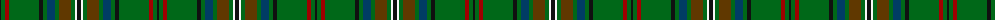

The parent of this is [MacClure Htg (Name)](/tartans/k/2/g4/dr4/g30/k4/g4/db8/g4/t12/g4/w2/k/4/)

This was sourced from tartans-authority.  It is a [12 stripes tartan](/stripes/stripes12/).

Original link http://www.tartansauthority.com/tartan-ferret/display/3331/

## Thread count
K/2 G4 DR4 G30 K4 G4 DB8 G4 T12 G4 W2 K/4

## Palette
Each colour and its ΔE from the base-6 reference it is a variant of.

| Colour | Shade | Base | ΔE (OKLab) |
|---|---|---|---|
| DB |  `#003C64` | B  | 0.07 |
| DR |  `#A00000` | R  | 0.09 |
| G |  `#006818` | G  | 0.02 |
| K |  `#101010` | K  | 0.17 |
| T |  `#603800` | G  | 0.16 |
| W |  `#F8F8F8` | W  | 0.01 |

ID: /variants/k/2/g4/dr4/g30/k4/g4/db8/g4/t12/g4/w2/k/4-db003c64-dra00000-g006818-k101010-t603800-wf8f8f8/
