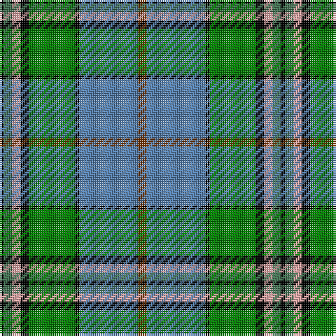

The parent of this is [Mission](/tartans/k/2/g4/lr4/k4/ga22/k2/b28/t/4/)

This was sourced from weddslist.  It is a [8 stripes tartan](/stripes/stripes8/).

Original link http://www.weddslist.com/cgi-bin/tartans/pg.pl?source=sts

## Thread count
K/2 G4 LR4 K4 Ga22 K2 B28 T/4

## Palette
Each colour and its ΔE from the base-6 reference it is a variant of.

| Colour | Shade | Base | ΔE (OKLab) |
|---|---|---|---|
| B |  `#5480B0` | B  | 0.20 |
| G |  `#407050` | G  | 0.10 |
| Ga |  `#008000` | G  | 0.09 |
| K |  `#000000` | K  | 0.00 |
| LR |  `#E0A0A0` | Y  | 0.17 |
| T |  `#703000` | R  | 0.18 |

# Sample pattern

ID: /variants/k/2/g4/lr4/k4/ga22/k2/b28/t/4-b5480b0-g407050-ga008000-k000000-lre0a0a0-t703000/
