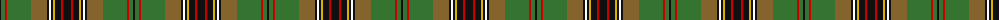

The parent of this is [Murphy (District)](/tartans/k/2/g4/r2/g24/lt16/k2/w2/k2/y2/k6/r2/k/8/)

This was sourced from tartans-authority.  It is a [12 stripes tartan](/stripes/stripes12/).

Original link http://www.tartansauthority.com/tartan-ferret/display/5645/

## Thread count
K/2 G4 R2 G24 LT16 K2 W2 K2 Y2 K6 R2 K/8

## Palette
Each colour and its ΔE from the base-6 reference it is a variant of.

| Colour | Shade | Base | ΔE (OKLab) |
|---|---|---|---|
| G |  `#347430` | G  | 0.07 |
| K |  `#101010` | K  | 0.17 |
| LT |  `#84642C` | G  | 0.16 |
| R |  `#C80000` | R  | 0.00 |
| W |  `#FCFCFC` | W  | 0.03 |
| Y |  `#D8B000` | Y  | 0.05 |

ID: /variants/k/2/g4/r2/g24/lt16/k2/w2/k2/y2/k6/r2/k/8-g347430-k101010-lt84642c-rc80000-wfcfcfc-yd8b000/
