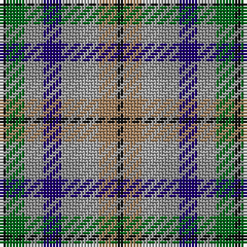

The parent of this is [Stewarton (Fashion)](/tartans/k/2/g6/na6/db6/na6/n6/lt6/k/2/)

This was sourced from tartans-authority.  It is a [8 stripes tartan](/stripes/stripes8/).

Original link http://www.tartansauthority.com/tartan-ferret/display/2367/

## Thread count
K/2 G6 Na6 DB6 Na6 N6 LT6 K/2

## Palette
Each colour and its ΔE from the base-6 reference it is a variant of.

| Colour | Shade | Base | ΔE (OKLab) |
|---|---|---|---|
| DB |  `#1C0070` | B  | 0.14 |
| G |  `#006818` | G  | 0.02 |
| K |  `#101010` | K  | 0.17 |
| LT |  `#A07C58` | R  | 0.19 |
| N |  `#A0A0A0` | Y  | 0.20 |
| Na |  `#888888` | R  | 0.24 |

# Sample pattern

ID: /variants/k/2/g6/na6/db6/na6/n6/lt6/k/2-db1c0070-g006818-k101010-lta07c58-na0a0a0-na888888/
