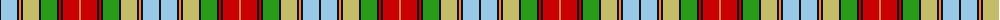

The parent of this is [BeeJay](/tartans/k/2/lb16/k2/o2/k2/lg16/k2/g16/k2/r2/k2/r16/o/2/)

This was sourced from tartans-authority.  It is a [13 stripes tartan](/stripes/stripes13/).

Original link http://www.tartansauthority.com/tartan-ferret/display/10767/

## Thread count
K/2 LB16 K2 O2 K2 LG16 K2 G16 K2 R2 K2 R16 O/2

## Palette
Each colour and its ΔE from the base-6 reference it is a variant of.

| Colour | Shade | Base | ΔE (OKLab) |
|---|---|---|---|
| G |  `#289C18` | G  | 0.18 |
| K |  `#101010` | K  | 0.17 |
| LB |  `#98C8E8` | W  | 0.17 |
| LG |  `#C4BC68` | Y  | 0.07 |
| O |  `#EC8048` | Y  | 0.17 |
| R |  `#C80000` | R  | 0.00 |

ID: /variants/k/2/lb16/k2/o2/k2/lg16/k2/g16/k2/r2/k2/r16/o/2-g289c18-k101010-lb98c8e8-lgc4bc68-oec8048-rc80000/
