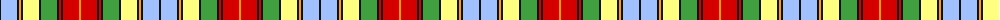

The parent of this is [BeeJay](/tartans/k/2/lb16/k2/y2/k2/ly16/k2/lg16/k2/r2/k2/r16/y/2/)

This was sourced from register-of-tartans.  It is a [13 stripes tartan](/stripes/stripes13/).

Original link https://www.tartanregister.gov.uk/tartanDetails.aspx?ref=10767

## Thread count
K/2 LB16 K2 Y2 K2 LY16 K2 LG16 K2 R2 K2 R16 Y/2

## Palette
Each colour and its ΔE from the base-6 reference it is a variant of.

| Colour | Shade | Base | ΔE (OKLab) |
|---|---|---|---|
| K |  `#101010` | K  | 0.17 |
| LB |  `#A0C0FF` | W  | 0.19 |
| LG |  `#40A040` | G  | 0.19 |
| LY |  `#FFFF80` | W  | 0.14 |
| R |  `#D40000` | R  | 0.03 |
| Y |  `#FFA000` | Y  | 0.08 |

ID: /variants/k/2/lb16/k2/y2/k2/ly16/k2/lg16/k2/r2/k2/r16/y/2-k101010-lba0c0ff-lg40a040-lyffff80-rd40000-yffa000/
