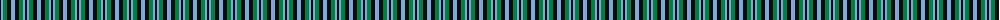
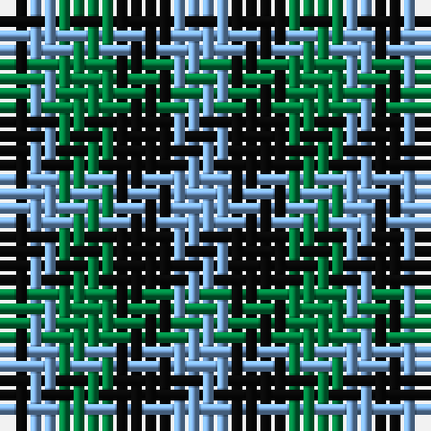

The parent of this is [Shepherd, Derek (Wandering)](/tartans/k/2/lb2/g4/k4/lb/4/)

This was sourced from register-of-tartans.  It is a [5 stripes tartan](/stripes/stripes5/).

Original link https://www.tartanregister.gov.uk/tartanDetails.aspx?ref=10169

## Thread count
K/2 LB2 G4 K4 LB/4

## Palette
Each colour and its ΔE from the base-6 reference it is a variant of.

| Colour | Shade | Base | ΔE (OKLab) |
|---|---|---|---|
| G |  `#008040` | G  | 0.09 |
| K |  `#0A0A0A` | K  | 0.14 |
| LB |  `#7AA9DD` | W  | 0.26 |

# Sample pattern

ID: /variants/k/2/lb2/g4/k4/lb/4-g008040-k0a0a0a-lb7aa9dd/
