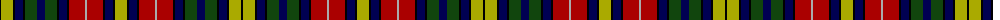

The parent of this is [Buchanan](/tartans/k/2/lg12/k2/db8/k2/dg12/db8/dg12/k2/db8/k2/dr16/n2/dr16/k2/db8/k2/lg/12/)

This was sourced from weddslist.  It is a [18 stripes tartan](/stripes/stripes18/).

Original link http://www.weddslist.com/cgi-bin/tartans/pg.pl?source=x

## Thread count
K/2 LG12 K2 DB8 K2 DG12 DB8 DG12 K2 DB8 K2 DR16 N2 DR16 K2 DB8 K2 LG/12

## Palette
Each colour and its ΔE from the base-6 reference it is a variant of.

| Colour | Shade | Base | ΔE (OKLab) |
|---|---|---|---|
| DB |  `#000052` | B  | 0.20 |
| DG |  `#11450D` | G  | 0.10 |
| DR |  `#AA0000` | R  | 0.06 |
| K |  `#000000` | K  | 0.00 |
| LG |  `#AAAA00` | Y  | 0.11 |
| N |  `#AAAAAA` | Y  | 0.19 |

ID: /variants/k/2/lg12/k2/db8/k2/dg12/db8/dg12/k2/db8/k2/dr16/n2/dr16/k2/db8/k2/lg/12-db000052-dg11450d-draa0000-k000000-lgaaaa00-naaaaaa/
