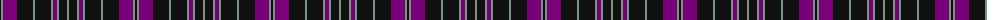

The parent of this is [Priest (Corporate)](/tartans/k/2/lg2/p14/k16/lg2/k16/lg2/p4/lg2/k8/lg/2/)

This was sourced from tartans-authority.  It is a [11 stripes tartan](/stripes/stripes11/).

Original link http://www.tartansauthority.com/tartan-ferret/display/246/

## Thread count
K/2 LG2 P14 K16 LG2 K16 LG2 P4 LG2 K8 LG/2

## Palette
Each colour and its ΔE from the base-6 reference it is a variant of.

| Colour | Shade | Base | ΔE (OKLab) |
|---|---|---|---|
| K |  `#101010` | K  | 0.17 |
| LG |  `#789484` | G  | 0.23 |
| P |  `#780078` | B  | 0.16 |

ID: /variants/k/2/lg2/p14/k16/lg2/k16/lg2/p4/lg2/k8/lg/2-k101010-lg789484-p780078/
