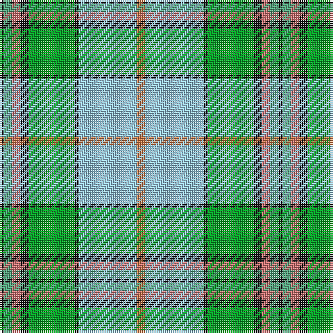

The parent of this is [Mission (District)](/tartans/k/2/lg4/lr4/k4/g22/k2/lb28/o/4/)

This was sourced from tartans-authority.  It is a [8 stripes tartan](/stripes/stripes8/).

Original link http://www.tartansauthority.com/tartan-ferret/display/2669/

## Thread count
K/2 LG4 LR4 K4 G22 K2 LB28 O/4

## Palette
Each colour and its ΔE from the base-6 reference it is a variant of.

| Colour | Shade | Base | ΔE (OKLab) |
|---|---|---|---|
| G |  `#00A424` | G  | 0.20 |
| K |  `#101010` | K  | 0.17 |
| LB |  `#98C8E8` | W  | 0.17 |
| LG |  `#50A47C` | G  | 0.23 |
| LR |  `#E87878` | R  | 0.19 |
| O |  `#EC8048` | Y  | 0.17 |

# Sample pattern

ID: /variants/k/2/lg4/lr4/k4/g22/k2/lb28/o/4-g00a424-k101010-lb98c8e8-lg50a47c-lre87878-oec8048/
