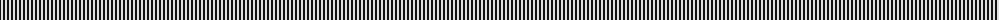
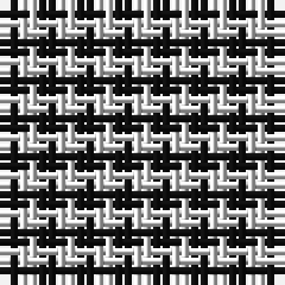

The parent of this is [Shepherd Check (Universal)](/tartans/k/2/ln/2/)

This was sourced from tartans-authority.  It is a [2 stripes tartan](/stripes/stripes2/).

Original link http://www.tartansauthority.com/tartan-ferret/display/1253/

## Thread count
K/2 LN/2

## Palette
K LN

# Sample pattern

ID: /variants/k/2/ln/2-k101010-lne0e0e0/
