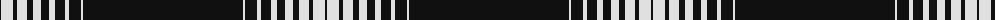

The parent of this is [Heolnezva ha Materi (Fashion)](/tartans/k/2/ln12/k4/ln10/k6/ln8/k8/ln6/k10/ln4/k12/ln2/k/160/)

This was sourced from tartans-authority.  It is a [13 stripes tartan](/stripes/stripes13/).

Original link http://www.tartansauthority.com/tartan-ferret/display/10492/

## Thread count
K/2 LN12 K4 LN10 K6 LN8 K8 LN6 K10 LN4 K12 LN2 K/160

## Palette
Each colour and its ΔE from the base-6 reference it is a variant of.

| Colour | Shade | Base | ΔE (OKLab) |
|---|---|---|---|
| K |  `#101010` | K  | 0.17 |
| LN |  `#E0E0E0` | W  | 0.06 |

ID: /variants/k/2/ln12/k4/ln10/k6/ln8/k8/ln6/k10/ln4/k12/ln2/k/160-k101010-lne0e0e0/
