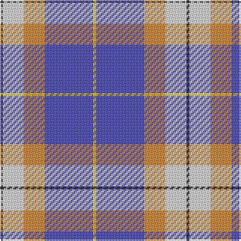

The parent of this is [Prehospital EMS (Corporate)](/tartans/k/2/ln14/o14/b32/y/2/)

This was sourced from tartans-authority.  It is a [5 stripes tartan](/stripes/stripes5/).

Original link http://www.tartansauthority.com/tartan-ferret/display/10182/

## Thread count
K/2 LN14 O14 B32 Y/2

## Palette
Each colour and its ΔE from the base-6 reference it is a variant of.

| Colour | Shade | Base | ΔE (OKLab) |
|---|---|---|---|
| B |  `#4444BC` | B  | 0.10 |
| K |  `#101010` | K  | 0.17 |
| LN |  `#E0E0E0` | W  | 0.06 |
| O |  `#D48428` | Y  | 0.16 |
| Y |  `#E8C000` | Y  | 0.00 |

# Sample pattern

ID: /variants/k/2/ln14/o14/b32/y/2-b4444bc-k101010-lne0e0e0-od48428-ye8c000/
