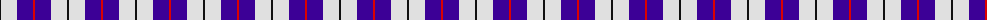
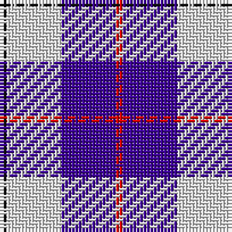

The parent of this is [MacRae Dress Purple](/tartans/k/2/ln16/p16/r/2/)

This was sourced from register-of-tartans.  It is a [4 stripes tartan](/stripes/stripes4/).

Original link https://www.tartanregister.gov.uk/tartanDetails.aspx?ref=5948

## Thread count
K/2 LN16 P16 R/2

## Palette
Each colour and its ΔE from the base-6 reference it is a variant of.

| Colour | Shade | Base | ΔE (OKLab) |
|---|---|---|---|
| K |  `#101010` | K  | 0.17 |
| LN |  `#E0E0E0` | W  | 0.06 |
| P |  `#3C0096` | B  | 0.11 |
| R |  `#DC0000` | R  | 0.04 |

# Sample pattern

ID: /variants/k/2/ln16/p16/r/2-k101010-lne0e0e0-p3c0096-rdc0000/
