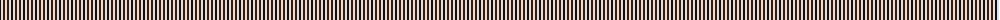
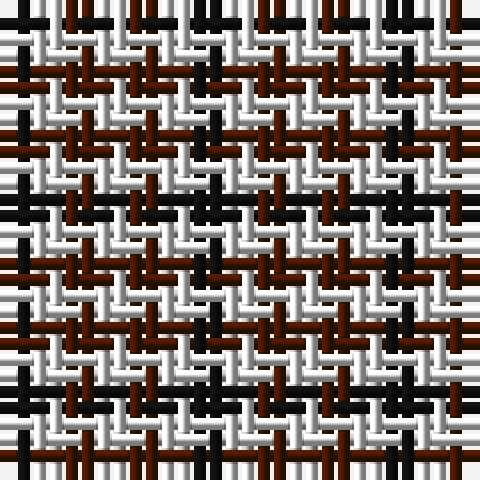

The parent of this is [Hogg](/tartans/k/2/ln2/dr2/ln/2/)

This was sourced from register-of-tartans.  It is a [4 stripes tartan](/stripes/stripes4/).

Original link https://www.tartanregister.gov.uk/tartanDetails.aspx?ref=1745

## Thread count
K/2 LN2 DR2 LN/2

## Palette
Each colour and its ΔE from the base-6 reference it is a variant of.

| Colour | Shade | Base | ΔE (OKLab) |
|---|---|---|---|
| DR |  `#441800` | B  | 0.22 |
| K |  `#101010` | K  | 0.17 |
| LN |  `#E0E0E0` | W  | 0.06 |
| N |  `#C0C0C0` | W  | 0.16 |

# Sample pattern

ID: /variants/k/2/ln2/dr2/ln/2-dr441800-k101010-lne0e0e0-nc0c0c0/
