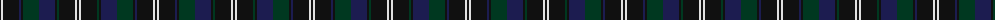

The parent of this is [Chess (Universal)](/tartans/k/2/ln2/k16/db2/k2/dg16/db16/k2/dg2/k16/ln2/k/2/)

This was sourced from tartans-authority.  It is a [12 stripes tartan](/stripes/stripes12/).

Original link http://www.tartansauthority.com/tartan-ferret/display/7824/

## Thread count
K/2 LN2 K16 DB2 K2 DG16 DB16 K2 DG2 K16 LN2 K/2

## Palette
Each colour and its ΔE from the base-6 reference it is a variant of.

| Colour | Shade | Base | ΔE (OKLab) |
|---|---|---|---|
| DB |  `#1C1C50` | B  | 0.14 |
| DG |  `#003820` | G  | 0.16 |
| K |  `#101010` | K  | 0.17 |
| LN |  `#E0E0E0` | W  | 0.06 |

ID: /variants/k/2/ln2/k16/db2/k2/dg16/db16/k2/dg2/k16/ln2/k/2-db1c1c50-dg003820-k101010-lne0e0e0/
