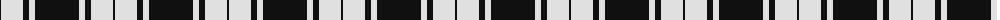

The parent of this is [MacPhee MacFee or MacIver](/tartans/k/2/ln22/k6/ln6/k/44/)

This was sourced from register-of-tartans.  It is a [5 stripes tartan](/stripes/stripes5/).

Original link https://www.tartanregister.gov.uk/tartanDetails.aspx?ref=2700

## Thread count
K/2 LN22 K6 LN6 K/44

## Palette
Each colour and its ΔE from the base-6 reference it is a variant of.

| Colour | Shade | Base | ΔE (OKLab) |
|---|---|---|---|
| K |  `#101010` | K  | 0.17 |
| LN |  `#E0E0E0` | W  | 0.06 |

# Sample pattern

ID: /variants/k/2/ln22/k6/ln6/k/44-k101010-lne0e0e0/
