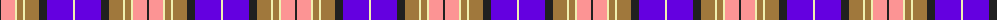

The parent of this is [Wcwm 1893-11](/tartans/k/2/lr14/ly2/lt6/ly2/lt14/k8/p26/ly/2/)

This was sourced from register-of-tartans.  It is a [9 stripes tartan](/stripes/stripes9/).

Original link https://www.tartanregister.gov.uk/tartanDetails.aspx?ref=4547

## Thread count
K/2 LR14 LY2 LT6 LY2 LT14 K8 P26 LY/2

## Palette
Each colour and its ΔE from the base-6 reference it is a variant of.

| Colour | Shade | Base | ΔE (OKLab) |
|---|---|---|---|
| K |  `#202020` | B  | 0.19 |
| LR |  `#FC9494` | Y  | 0.18 |
| LT |  `#A0783C` | R  | 0.18 |
| LY |  `#F0F0B0` | W  | 0.08 |
| P |  `#6400E0` | B  | 0.18 |

ID: /variants/k/2/lr14/ly2/lt6/ly2/lt14/k8/p26/ly/2-k202020-lrfc9494-lta0783c-lyf0f0b0-p6400e0/
