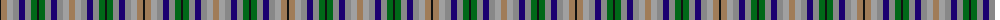

The parent of this is [Stewarton (Personal)](/tartans/k/2/lt6/na6/n6/db6/n6/g6/k2/g6/n6/db6/n6/na6/lt/6/)

This was sourced from register-of-tartans.  It is a [14 stripes tartan](/stripes/stripes14/).

Original link https://www.tartanregister.gov.uk/tartanDetails.aspx?ref=3961

## Thread count
K/2 LT6 Na6 N6 DB6 N6 G6 K2 G6 N6 DB6 N6 Na6 LT/6

## Palette
Each colour and its ΔE from the base-6 reference it is a variant of.

| Colour | Shade | Base | ΔE (OKLab) |
|---|---|---|---|
| DB |  `#1C0070` | B  | 0.14 |
| DO |  `#B84C00` | R  | 0.08 |
| DY |  `#D09800` | Y  | 0.11 |
| G |  `#006818` | G  | 0.02 |
| K |  `#101010` | K  | 0.17 |
| LG |  `#C4BC68` | Y  | 0.07 |
| LR |  `#E8CCB8` | W  | 0.11 |
| LT |  `#A07C58` | R  | 0.19 |
| N |  `#888888` | R  | 0.24 |
| Na |  `#A0A0A0` | Y  | 0.20 |

ID: /variants/k/2/lt6/na6/n6/db6/n6/g6/k2/g6/n6/db6/n6/na6/lt/6-db1c0070-dob84c00-dyd09800-g006818-k101010-lgc4bc68-lre8ccb8-lta07c58-n888888-naa0a0a0/
