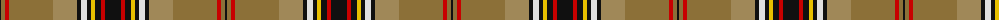

The parent of this is [O'Keefe (Name)](/tartans/k/2/lta4/r4/lta44/lt24/k4/ln6/k4/y4/k6/r4/k/16/)

This was sourced from tartans-authority.  It is a [12 stripes tartan](/stripes/stripes12/).

Original link http://www.tartansauthority.com/tartan-ferret/display/1176/

## Thread count
K/2 LTa4 R4 LTa44 LT24 K4 LN6 K4 Y4 K6 R4 K/16

## Palette
Each colour and its ΔE from the base-6 reference it is a variant of.

| Colour | Shade | Base | ΔE (OKLab) |
|---|---|---|---|
| K |  `#101010` | K  | 0.17 |
| LN |  `#E0E0E0` | W  | 0.06 |
| LT |  `#A08858` | Y  | 0.21 |
| LTa |  `#8C7038` | G  | 0.18 |
| R |  `#C80000` | R  | 0.00 |
| Y |  `#E8C000` | Y  | 0.00 |

ID: /variants/k/2/lta4/r4/lta44/lt24/k4/ln6/k4/y4/k6/r4/k/16-k101010-lne0e0e0-lta08858-lta8c7038-rc80000-ye8c000/
