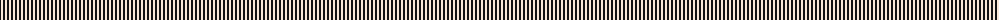
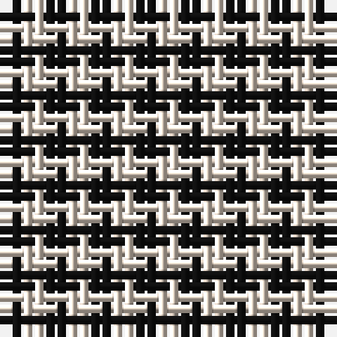

The parent of this is [Shepherd or Falkirk](/tartans/k/2/ly2/k2/ly/2/)

This was sourced from register-of-tartans.  It is a [4 stripes tartan](/stripes/stripes4/).

Original link https://www.tartanregister.gov.uk/tartanDetails.aspx?ref=3781

## Thread count
K/2 LY2 K2 LY/2

## Palette
Each colour and its ΔE from the base-6 reference it is a variant of.

| Colour | Shade | Base | ΔE (OKLab) |
|---|---|---|---|
| K |  `#101010` | K  | 0.17 |
| LY |  `#F8E8D8` | W  | 0.04 |

# Sample pattern

ID: /variants/k/2/ly2/k2/ly/2-k101010-lyf8e8d8/
