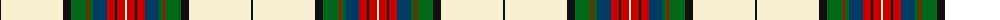

The parent of this is [Hohenzollern](/tartans/k/2/ly62/k8/g16/r2/g4/dba14/r8/k2/r8/ly/2/)

This was sourced from register-of-tartans.  It is a [11 stripes tartan](/stripes/stripes11/).

Original link https://www.tartanregister.gov.uk/tartanDetails.aspx?ref=1747

## Thread count
K/2 LY62 K8 G16 R2 G4 DBa14 R8 K2 R8 LY/2

## Palette
Each colour and its ΔE from the base-6 reference it is a variant of.

| Colour | Shade | Base | ΔE (OKLab) |
|---|---|---|---|
| DB |  `#2C2C80` | B  | 0.05 |
| DBa |  `#003C64` | B  | 0.07 |
| G |  `#006818` | G  | 0.02 |
| K |  `#101010` | K  | 0.17 |
| LB |  `#98C8E8` | W  | 0.17 |
| LY |  `#F8F0D0` | W  | 0.04 |
| R |  `#C80000` | R  | 0.00 |
| Y |  `#E8C000` | Y  | 0.00 |

ID: /variants/k/2/ly62/k8/g16/r2/g4/dba14/r8/k2/r8/ly/2-db2c2c80-dba003c64-g006818-k101010-lb98c8e8-lyf8f0d0-rc80000-ye8c000/
