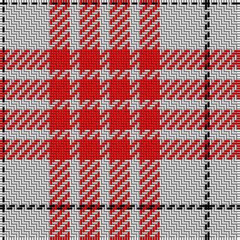

The parent of this is [Buchanan VS](/tartans/k/2/n18/r8/n4/r8/n/4/)

This was sourced from weddslist.  It is a [6 stripes tartan](/stripes/stripes6/).

Original link http://www.weddslist.com/cgi-bin/tartans/pg.pl?source=rb

## Thread count
K/2 N18 R8 N4 R8 N/4

## Palette
Each colour and its ΔE from the base-6 reference it is a variant of.

| Colour | Shade | Base | ΔE (OKLab) |
|---|---|---|---|
| K |  `#000000` | K  | 0.00 |
| N |  `#D0D0D0` | W  | 0.11 |
| R |  `#FF0000` | R  | 0.11 |

# Sample pattern

ID: /variants/k/2/n18/r8/n4/r8/n/4-k000000-nd0d0d0-rff0000/
