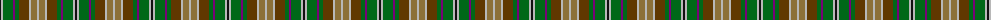

The parent of this is [Corcoran of Sherbrooke (Name)](/tartans/k/2/n2/g10/p2/g4/t10/n2/lt6/n/2/)

This was sourced from tartans-authority.  It is a [9 stripes tartan](/stripes/stripes9/).

Original link http://www.tartansauthority.com/tartan-ferret/display/4584/

## Thread count
K/2 N2 G10 P2 G4 T10 N2 LT6 N/2

## Palette
Each colour and its ΔE from the base-6 reference it is a variant of.

| Colour | Shade | Base | ΔE (OKLab) |
|---|---|---|---|
| G |  `#006818` | G  | 0.02 |
| K |  `#101010` | K  | 0.17 |
| LT |  `#8C7038` | G  | 0.18 |
| N |  `#B8B8B8` | Y  | 0.17 |
| P |  `#780078` | B  | 0.16 |
| T |  `#603800` | G  | 0.16 |

ID: /variants/k/2/n2/g10/p2/g4/t10/n2/lt6/n/2-g006818-k101010-lt8c7038-nb8b8b8-p780078-t603800/
